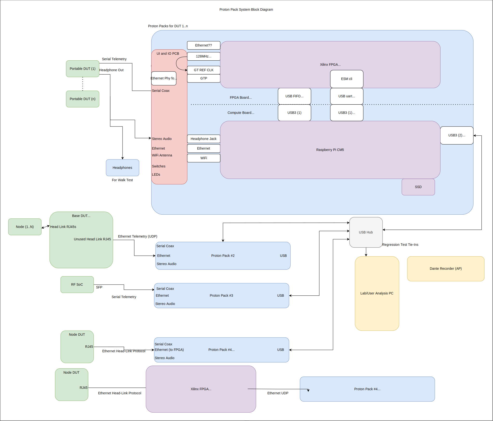

# Proton Pack Telemetry Capture System

## About

The Proton Pack is a portable telemetry system designed to capture and display real time visualizations and record data for analysis from embedded FPGA systems.

# System Architecture

The system is composed of hardware and software components and a protocol for sending telemetry data from a DUT over a serial link.

The software is split between two components: live, real-time visualization software and post processing software.

## Block Diagram




## Proton Pack Hardware

Proton Pack hardware is described under the [hardware/REDAME.md](hardware/README.md) file

## Live Visualization Software

This software will read in a recorded telemetry stream and produce live visualizations with low latency to aid in
providing rapid feedback during walk testing.

## Capture Scripting

Time synchronization.
Pairing (telemetry pack to a portable)

## Post processing software

The post processing software takes the captured telemetry and prepares it for analysis in python and for rapid visualization of a given time period of the capture. It converts the format to hdf5 and is in charge of aligning all of the data from multiple DUT's capturing simultaneous telemetry.

# It works on my machine

run 
```scripts/test_install.sh

# Design Notes

design notes are left out of this document to avoid [clutter](doc/design_notes.md)


# Copyright

Copyright (c) 2025, Shure Incorporated

Nicholas Dietz (dietzn@shure.com)

Proton Pack software is licensed according to the [LICENSE](./LICENSE) file.
