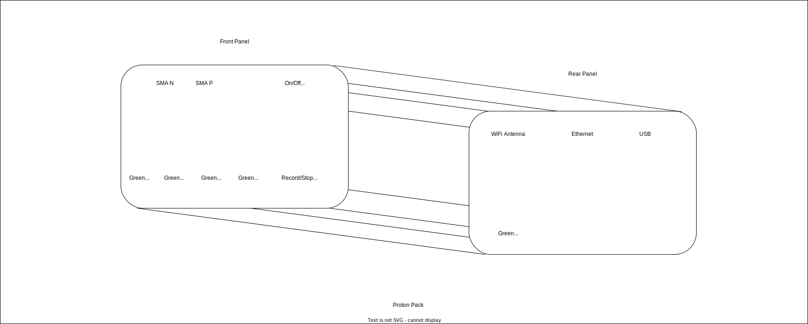

# Design notes

Stuff that may be speculative, todo, etc.

https://forums.raspberrypi.com/viewtopic.php?t=363027
https://www.youtube.com/watch?v=sbrCiN6HGrI

1455 series enclosures

https://en.wikipedia.org/wiki/Eurocard_(printed_circuit_board)

https://en.wikipedia.org/wiki/Raspberry_Pi

Real Time Clock.
pi 5 includes RTC.

compute module 5

https://www.raspberrypi.com/products/compute-module-5/?variant=cm5-104032

https://en.wikipedia.org/wiki/Precision_Time_Protocol

does compute module 5 have RTC?
yes?
https://bret.dk/raspberry-pi-compute-module-5-review-cooler-faster-better/

https://www.raspberrypi.com/documentation/computers/raspberry-pi.html

todo: test with pc first.
test with raspberry pi5
complete with compute module 5.

Can it

We don't need GPS, only NTP that's synced to the same time.

todo: add CRC to link protocol.
todo: add crc checking and display to software. Possibly just an error counter.

Green link light. Indicates link is up and no data errors. Goes red for 3 seconds if there is any error.
Blue link light. Displays blue if some threshold is reached. BER/SNR/power/etc.
todo: how to define?

todo: write definition of what current telemetry system does.

todo: can the compute module automatically convert pcapng to hdf5.

should it be done in C++ for speed?
should it be optimized using a profiler?
should it be done as a stream?
should it be broken into chunks as a pcapng?
as an hdf5?

todo: 

Internal to the #Axient #Digital #PSM Receiver (ADXR) that #Shure just shipped there is, unsurprisingly, a programming header 
that exposes #serial, #JTAG, etc. It is in violation of [Murphy's](https://en.wikipedia.org/wiki/Edward_A._Murphy_Jr.) law. 
This stupid cable has the same connector at both ends, but is electrically asymmetrical. It has no key feature and has
no obvious polarity marking on the board or on the cable.

We are now starting to design the next generation product. I have added to my list that I will not allow this mistake to 
propogate to the new design.

#electronics

# Bandwidth 

Plan of record: support at least 4Msamples/sec * 16 bits/channel * 2 channels/sample = 128 Mbit/sec

Why: in order to capture a 2MHz channel of I/Q samples and prove the link does not drop packets, etc.

Link bandwidth is 1.024 Mbit/sec
based on 128MHz clock * 8x oversampling in the serializer.

We should try turning up the bandwidth until something breaks. 
The bandwidth will be also limited by the link overhead.

## bandwidth of dpsm_rx_sc:
158.1 Mbps
A typical pcapng file is about 156,811 packets per second. Or 25,090,194 bytes per second, or 200,721,551 bits per second.

# Theoretical serial link bandwidth

The ADXR serial link bandwidth has never been pushed or confirmed with any test or sim.
It is a 1.024 Gbps serial link. Currently, ignoring timestamp and overhead, it can send 32bits of data bits per 11 byte packet. Presuming one byte of idle between packets, the absolute maximum data bandwidth is: 341.3 Mbps.
 
However the bandwidth of the AC701 serial link, the PC serial interface, linux drivers, buffers, etc. on the PC side might also be limiting depending on the ethernet packet size, packet spacing, etc.
 
We will be pushing as high as we can with the single-carrier work; the sample rate is much higher, hence the question. I think we're around 275 Mbps total at the moment (11 bytes/packet, 20 fields @ 156.8 ksam/s).
 
To be clear: measuring that way you are describing it (i.e. including overhead and timestamp in the bandwidth) the total bandwidth is 938.7 Mbps... the 341.3Mbps includes only the data (a ratio of 4/12).
 

# Top level description

so i'm just going to describe the, the basic proton pack as it is now, which is

laptop.
and a dev board.
and a battery pack, and a usb switch.
hub.

and recording device, audio recording device, and, uh,

pretty much it.
and you plug it into a serial link using coax.
and then

streams the data through this serial link into the eval board.
converts to the ethernet, puts it on hard drive.
and once it's on the hard drive, we can process it.
and post process it to look at it.

we can also do live visualization.

## key new features.
* multiple devices under test now, multiple transceivers and a base station that all need to be tracked
* synchronized in time.
* try to reuse as much as we can with the current telemetry.

plan of record: and the approach we've taken is to use a timestamp that comes from the 128 mhz clock on the board.
so whatever the fixed clock is on the, on the portable device or on the fixed device will timestamp the samples of data.
and when they get to the
the capture side, i'm going to have a periodic packet, the, once per
second, config packet that comes through.
we can use the timing of that, which should be accurate.
and we can timestamp those once per second.
downbeat packets with the real time clock.
and then, once we get the data into the pc, 
we can align the data from different sources, using those real time clocks.
the key there, of course, is to keep the real time clocks synchronized.

bring in multiple pcap's convert to one hdf5.
presents them as a bundle.

portable will have a tunable reference. 
tunes to the overall signal in the down link.

what is the slew rate of the pull in?
Timestamp all packets.
todo: consider that the portable clock is being pulled. that clock will drive a counter that timestamps into the fifo.
When they get to the snickerdoodle they will be delayed by a variable amount. Can the time through the fifo be modeled?
Then subtracted off?
Is it close enough to just use time of arrival of the latest timestamp? An hdl model would be useful here.
todo: resurrect hdl model of full telemetry.

* but that's sort of a solved problem already.
ptp. ntp. gps, there's lots of different ways of doing that.

* we don't have to put gps on the units.
* so we don't have to do any, you know, bidirectional link across to the units.
* so we're going to start with that. and if that's accurate enough, we're good.
* if not, we can do additional work to try to make it tighter.
* i think that that should be fine, because if you're kind of 
sub symbol accurate, which i think you can achieve, like, microsecond type of accuracy.
i think that's probably good for our purposes.
in terms of synchronzing.
the system behavior.
because, you know, symbols are sort of our quanta.

### robustness
so the next thing is, robustness of the mechanical assembly

### size
the size of the pack.
so we would like it to be significantly smaller.
i'd like to not run it on a laptop.
i'd like to run it on something like a raspberry pie, compute.
module.
just to make it physically smaller.
### rf rugged.
in the sense that we don't want our capture telemetry capture system to be influencing the noise floor of our receivers.
so, keeping it inside and aluminum enclosure with rf gaskets, which i have, i've done a little research to, to, to pick out an enclosure that should work.

## fast to develop
and then i'm thinking of, forgo having a display, 

## idiot proof
we'll just have an idiot light, like a, you know, we'll have a light that comes on when it's when it's, when the link is
established.
and we'll have another light that comes on when you meet some performance criteria based on the data coming across, either, packet rate is at where you expect it to be.
within, within a window where you expect it to be, or you could even go to the level of parsing the data and looking at, like, link status and see that you got a link status that it
works.
so you can have a light that goes on when you get link and that should give you as much confidence as, you know, the fancy visualization.

## Automated
Plug each node in to the USB hub and the host PC will identify that it's part of a test and copy the data off the device and then wipe the device.
It will then process the data into an output hdf5 format and indicate to the user that all the files are done and the output hdf5 is ready for analysis.
It can be a set of hdf5's so you can not have to configure how many devices you are capturing on, and just capture on however many you want.

### prototype steps

#### raspberry pi can handle bandwidth?
so we're going to prototype that with a raspberry pie and make sure that we can handle a bandwidth.
on our current system.
that shouldn't be hard to do because the code should already just run on a raspberry pie.
it's already got ethannet.
so, we're going to start swapping in and prototyping those bits.

#### measure power on compute module
if you can run out of compute module and the power's low enough, we could size a battery appropriately to fit this into a small aluminum enclosure.
#### battery size requirements
tbd
#### enclosure requirements

* rf gasket
* forgo display
* idiot light when the link is established.
* another light that comes on when you meet some performance criteria based on the data coming across, or when the packet rate is at where you expect it to be.
* just have a switch. when you flip it, starts the recording, when you flip it off, it stops the recording.
  have that script under the switch and a raspberry pie, just kick off the process you need to start and stop it.
* and the feedback can come from an led from a pin.

#### rob mamola proof
 i want him to be not intimidated to grab the thing and go off on his own and walk down the street and record some stuff.
 and report the results later.
 and i want that to go smoothly.
 so that's, that's, like, the success criteria.
 if rob can, if rob can take it, to nashville, without me, i have succeeded.

##### telemetry should work even if telemetry poke command is issued twice.

# ROBUSTANCE OF THE SERIAL LINK.
crc checks on that serial link.

# error injector.
to inject a low level bit air rate.
and i want to design the software all the way through the stack to gray's fully mark those packets as
not available.

# mechanical strain relief for cabling.
u.FL is not a good cable to launch off the pack without some other feature to secure it.

# Visualization software

challenge: create a fast way to view the data.
Options:
plot_tv.py (current solution. Maybe have a button to 'run a script on this section?')
vaex
https://github.com/flekschas/jupyter-scatter
https://vegafusion.io/about/how_it_works.html
jupyter-scatter
datashader
plotly
bokeh

# Hardware Roadmap Milestones and Tasks

Risk items are listed first. Risk items are tasks that prove out unknowns, or determine architectural decisions and should be done first.

## Task -  Select Embedded Computer Platform - Test Raspberry Pi 
Plan of Record is Compute Module 5.
Risk item: Can it handle the sustained bandwidth from ethernet to SSD.

## Task - Select Deserializer Platform - Test Snickerdoodle Black (Plan of Record)
Risk item: unexpected issues with new platform? Signal Integrity, power draw?

### Task - Build base board with SMA connectors

### Task - Select Enclosure
Plan of Record - Hammond RF Gasketed Aluminum enclosure.

### Task - Deisgn build and test enclosure front and back panels.
Control of LEDs, switch to start/stop recording.
Wiring harnesses, etc.

### Task - Test system level recording functionality.
Multiple packs, audio synchronization.

### Task - Prove out RTC synchronization.

### Task - Design, Implement, and Test Serial Link improvements - CRC

Add CRC check and CRC error injector and test through to visualization steps. 

### Task - Design, Implement, and Test Serial Link improvements - Mechanical Vibration

Add mechanical robustness features to ATLAS requirements, prototype and test.

### Task - design battery pack and charging mechanism.
Measure power draw. Plan for 8 hours of run time. 
Plan of Record: off-the-shelf USB battery bank. (Support of simultaneous charging)
Determine need for custom charging circuitry on base board PCB design.

### Task - Test RF Noise floor - Current system in enclosure.

### Task - Test RF Noise floor - Raspberry Pi/Snickerdoodle Black system in enclosure.

### Task - Fast real time visualization
Needs to be able to handle 8 packs, a base station, and a fader, telemetry and audio, at a ~5 minute walk time.
Design new API?
vaex, plotly?

# Notes

## Potential Hardware platforms
Cameron Crump:

I floated this idea as a PC for your telemetry machine also:

### CWWK Intel Alder Lake N100
 
* CPU: N100|i3-N305
* RAM: 1*SO-DIMM DDR5 4800MHz compatible with 5200/5600MHz
* SSD: 1*M.2 NVme (PCIe3.0x1 signal), 1*SATA3.0, 1*TF
* Graphics card: Intel UHD Graphics
* Display: 1*HDMI2.0 4096x2160@60Hz
* 1*DP1.2 4096x2160@60Hz
* 1*Type-C 4096x2160@60Hz
* Network card: 4*Intel i226-V 2.5G network card
* USB: 1*USB3.0 | 5*USB2.0
* Cooling: Dual heat pipe turbo active cooling
* BIOS: AMI EFi BIOS supports automatic start-up, watchdog, GPIO, PXE
* Power consumption: 6W (basic power consumption) | 15W (maximum turbo power consumption)
* Power supply: DC-12V
* Chassis: Aluminum alloy
* Expansion pin header: 1*TPM pin header, 1*FPANEL, 1*GPIO pin, 1*COM pin
* Expandable: PCI-E x8 socket (x4 signal) can be plugged into Intel 82599ES dual 10G optical port
* Intle i210/i211/i226-V four network ports | 4 x1 signal M.2 adapter boards
* Size: 131.7mm (length) * 155mm (width) * 60mm (height)
* Color: Cool black, iron gray (no color is noted, random color is shipped)
* Installation method: desktop (can contact to purchase wall mounts)
* Working environment: -0°C~+70°C, relative humidity 5%-85%
 

https://www.amazon.com/CWWK-Mini-PC-10-Gigabit/dp/B0D5M2GHQH
 
since we don't have to worry about ARM,

 *Intel 12th generation AlderLake-N low-power eight-core processor, HDMI+DP+Type-C triple display, support 4K@60Hz.  
 

 ### Orange Pi Plus
check out Dietz, Nick
https://www.amazon.com/Orange-Pi-Plus-32GB-Development/dp/B0CKP353FY
Amazon.com: Orange Pi 5 Plus 32GB LPDDR4/4x Rockchip RK3588 8-Core 64-Bit Single Board Computer with eMMC Socket, Development Board Run Orange Pi/Ubuntu/Debian/Android 12 OS (Pi 5 Plus 32G) : Elect...
 🍊[Up to 32GB RAM]: Meet the application requirements of products, Orange Pi upgraded RAM to large 32GB which means users have ample storage capacity andmore powerful data processing capabilities.  
 

