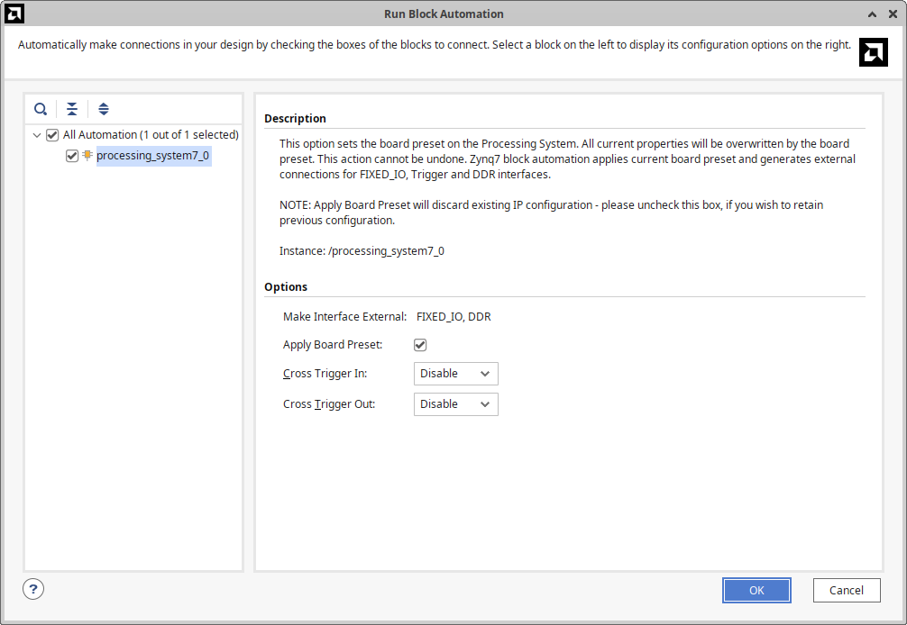
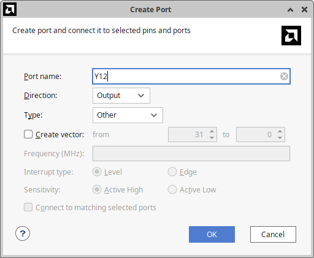

# Snickerdoodle Black
It was not easy getting the snickerdoodle black alive based on the tutorials and documentation available from krtkl. I had done some basic work on this many years ago, but everything is very out of date, and many things have changed, breaking scripts and commands in the tutorials if you try to work with modern versions of Vivado. Even the SDK is now called Vitis.

There seems to be no complete and reliable "hello world" for 2025. 

My goal here is to present the exact steps to resurrect a snickerdoodle black in 2025 and produce a button input and a toggling output from a verilog source.

That means starting from an unprogrammed SD card and doing all the steps necessary to integrate your custom verilog, power and communicate with the board via serial, configure wifi, etc.


## Board bring up tutorial

### load image into sdcard.

### Install Vivado/SDK and debork for linux.

Vivado and Vitis 2024.2 

### Create vivado project

This is based on the old and incomplete tutorial from Krtkl: 

https://github.com/krtkl/snickerdoodle-manual/blob/master/snickerdoodle-hardware-configuration/snickerdoodle-hardware-configuration.pdf

These instructions should make looking at the original pdf unnecessary:


Get the files and make a local reference so they can't be deleted/changed/rotted/paywalled.
```
wget https://github.com/krtkl/snickerdoodle-board-files/archive/master.zip
unzip master.zip 
rm master.zip
git add snickerdoodle-board-files-master/
rsync -av --exclude-from=EXCLUDE ./* /tools/Xilinx/Vivado/2024.2/data/boards/board_files/
```


## Create new project in GUI.
Now the hard to script part.

First confirm you've got 2024.2
```
source /tools/Xilinx/Vitis/2024.2/settings64.sh 
which vivado
vivado
```


File->Project->New

Next

Project name: vivado_project
Project location: 'your working directory'


Next


Next


Next


Boards
Display Name: snickerdoodle Black Development Platform
Next


Finish


## Create Block Design

Flow->Create Block Design

Design name: block_design
OK


'+' button to add IP.


Search: zynq
Click "ZYNQ7 Processing System"
Enter 


Click "Run Block Automation"


OK



Page Navigator
PS-PL Configuration
Name: ACP SLlave AXI Interface
Unselect S AXI ACP interface
OK


Page Navigator
Clock Configuration
Component: PL Fabric Clocks
Unselect FCLK_CLK1, FCLK_CLK2 and FCLK_CLK3
OK


Expected state.


File->Add Sources...
Add or create design sources
Next
Create File

File name: blink.v

Finish


I/O Port Definitions:
Port Name/Direction
clk/input
inny/input
outy/ouptut

OK


Right Click->Add Module
blink (blink.v)
OK


Sources
Design Sources
blkni (blink.v)
double click
Enter hdl code:

```
`timescale 1ns / 1ps
module blink(
    input wire clk,
    input wire inny,
    output reg outy
    );
    
     // Parameters to calculate clock division factor
    // 100 MHz is 100,000,000 cycles per second, to get 1 second period we divide by 100,000,000
    parameter CLK_DIV = 100_000_000;

    reg [31:0] counter;  // 32-bit counter for clock division
    reg one_second_clock;  // 1 Hz signal generated

    // Clock divider process
    always @(posedge clk) begin
        if (counter == CLK_DIV - 1) begin
            counter <= 0;
            one_second_clock <= ~one_second_clock;
        end else begin
            counter <= counter + 1;
        end
    end

    // Toggle output 'outy' process
    always @(posedge clk) begin
        outy <= inny ? ~one_second_clock : one_second_clock;
    end
    
endmodule
```

Sources
Design Sources
Constraints
constrs_1
right click->Add Sources...
Add or create constraints
Next

Create file
File name: pins.xdc
OK


Finish

Sources
Design Sources
Constraints
constrs_1
pins.xdc
double click

enter constraints

right click->Save File

```
set_property PACKAGE_PIN T9 [get_ports T9]
set_property PACKAGE_PIN Y12 [get_ports Y12]

set_property IOSTANDARD LVCMOS18 [get_ports T9]
set_property IOSTANDARD LVCMOS18 [get_ports Y12]
```


Wire up clk to M_AXI_GP0_ACLK


Right Click->Create Port...

Port name: T9
Direction: Input


Port name: Y12
Direction: Output




expected state


Sources
Design Sources
block_design
right click->Create HDL Wrapper


Let Vivado manage wrapper and auto-update
OK


Sources
Design Sources
block_design_wrapper
right click-> Set as Top


## Generate Bitstream
Flow-> Generate Bitsttream
OK to launch synthesis and implementation? YES
Launch Runs
OK

# Export Design with Vitis
File -> Export -> Export Hardware...
Export Hardware Platform
Next
Include bitstream
Next


XSA file name: block_design_wrapper
Next
Finish


# put image on board:
serial connect to board:

# ssh to board
find ip via serial

```
ip a
```
find wlan0 ipv4 address

```
ssh proton@192.168.1.209
```

mount drive

```
sshfs proton@192.168.1.209:/ ~/snickerdoodle
```

copy into temporary spot and then in to place
```
cp ./hardware/vivado_project/vivado_project.runs/impl_1/block_design_wrapper.bit ~/snickerdoodle/home/proton/system.bit
poleguy@elgar:~/fpga-data/2025/protonpack$ ssh -t proton@192.168.1.209 sudo cp system.bit /boot
```

inny and outy
on snickerdoodle:
PC1
8 and 14 
are GPIO 3 and 7
T9 and Y12

on snickerdoodle pismasher:
JC1
8 and 14
PC1
8 and 14


# Future ideas

Extend this to discuss application design as well.

Where does the White LED heartbeat come from, and how can I change it?

It's running linux: Is a user app is run by default? How to change it?

Best practices?


# Design Notes 

## porting in ac701 design

git clone ssh://git@bitbucket.shure.com:7999/fpga/telem_mobile_ac701.git
cd telem_mobile_ac701
git checkout 0.0.99.146.20240104103112

## working dir
~/fpga-data/2024/protonpack/hardware/


# Troubleshooting

[Project 1-486] Could not resolve non-primitive black box cell 'block_design_blink_0_1_blink' instantiated as 'block_design_i/blink_0/inst' ["/home/poleguy/fpga-data/2025/protonpack/hardware/vivado_project/vivado_project.gen/sources_1/bd/block_design/ip/block_design_blink_0_1/synth/block_design_blink_0_1.v":71]

Failed to enter verilog code for blink.v


xc7s020clg400-3
how many transceivers do we have?
0.
uhoh.
big goof.
