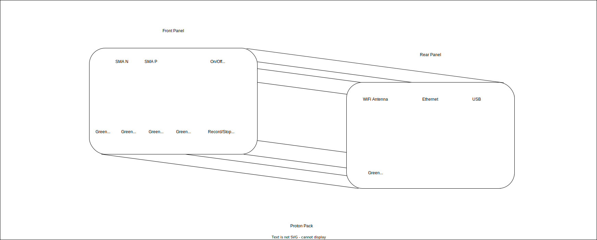
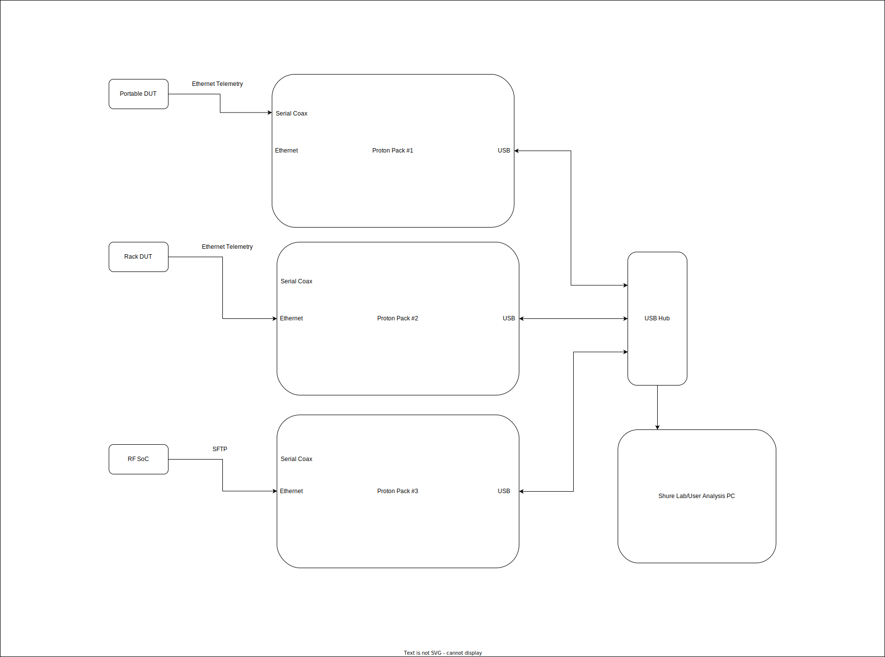

# Proton Pack Hardware

# Hardware

The hardware consists of a capture system that records a data stream provided from a device under test (DUT) via a pair of coaxial cables.

# DUT hardware.

The signal from the DUT is sent from a standard FPGA GPIO pin to avoid requiring a transceiver. A transceiver would also work.
The signalling is HSTL-II to provide a fast signal rate of 1GBps or higher.

No termination is needed on the DUT. The transmission pair lines are wired simply to a pair of coax connectors.

On the receiving device the termination should be AC coupled into an MGT transceiver that is internally terminated.

It could also be directly connected as on the AC701 board.

# HDL 

The core design is in verilog. It's job is to serialize data and then deserialize the data and push it to memory and then to disk via the microprocessor system.

## Simulation

CVC64 is used for simulation.

### Setup

install prerequisites: 

Ubuntu 22.04 or 24.04

Vivado version (e.g. 2022.1) as specified in  scripts/setup_vivado

CVC64

http://www.tachyon-da.com/home/how-to-purchase-cvc-enterprise-support/

or from here with no login:

https://github.com/cambridgehackers/open-src-cvc

### Run sim

`./run_sim`

# FPGA Board

Alchitry Board

Breakout board schematic must connect: 

Bottom Side, Bank B, J7 36/34 to 53/51 respectively

Input SMA must go to: 

Bottom Side, Bank B, J7 71/69 for P/N respectively

# Legacy

Snickerdoodle Black is no longer used

[snickerdoodle_black.md](../doc/snickerdoodle_black.md)

# Reference

## Cabling
https://www.ti.com/lit/an/slyt163/slyt163.pdf?ts=1736333230589

## HSTL signaling
https://en.wikipedia.org/wiki/High-speed_transceiver_logic

## AC701 Schematic
https://www.xilinx.com/support/documents/boards_and_kits/artix-7/ac701-schematic-xtp218-rev1-0.pdf

## MGT Termination
https://adaptivesupport.amd.com/s/article/75774?language=en_US
https://0x04.net/~mwk/xidocs/ug/ug476_7Series_Transceivers.pdf

## The Proton Pack Is Not A Toy
https://www.youtube.com/@TheProtonPackIsNotAToy

## XAPP523

https://docs.amd.com/v/u/en-US/xapp523-lvds-4x-asynchronous-oversampling

Alternative, PG047:

https://docs.amd.com/r/en-US/pg047-gig-eth-pcs-pma/LVDS-Transceiver-for-7-Series-and-Zynq-7000-Devices

# Copyright

Copyright (c) 2025, Shure Incorporated

Proton Pack Hardware is licensed under the CERN-OHL-P-2.0 license found in the [LICENSE](./LICENSE) file.
